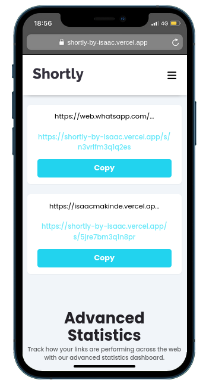

# Frontend Mentor - Shortly URL shortening API Challenge solution

This is a solution to the [Shortly URL shortening API Challenge challenge on Frontend Mentor](https://www.frontendmentor.io/challenges/url-shortening-api-landing-page-2ce3ob-G). Frontend Mentor challenges help you improve your coding skills by building realistic projects.

## Table of contents

- [Overview](#overview)
  - [The challenge](#the-challenge)
  - [Screenshot](#screenshot)
  - [Links](#links)
- [My process](#my-process)
  - [Built with](#built-with)
  - [What I learned](#what-i-learned)
  - [Form validation and error handling patterns](#form-validation-and-error-handling-patterns)
  - [Useful resources](#useful-resources)
- [Author](#author)

## Overview

### The challenge

Users should be able to:

- View the optimal layout for the site depending on their device's screen size
- Shorten any valid URL
- See a list of their shortened links, even after refreshing the browser
- Copy the shortened link to their clipboard in a single click
- Receive an error message when the `form` is submitted if:
  - The `input` field is empty

### Screenshot




### Links

- Solution URL: [Solution](https://github.com/Oluwa-Laughter/shortly)
- Live Site URL: [Live Preview](https://shortly-by-isaac.vercel.app/)

## My process

### Built with

- [React](https://reactjs.org/) - JS library
- [TailwindCSS](https://tailwindcss.com/) - CSS framework
- [Vite](https://vitejs.dev/) - Build tool
- [Supabase](https://supabase.com/) - API Database
- [React-copy-to-clipboard](https://www.npmjs.com/package/react-copy-to-clipboard) - Copies URL to clipboard
- [Vercel](https://vercel.com/) - Deployment

### What I learned

During this project, I gained valuable experience in:

- Implementing async/await patterns for API interactions with proper error handling
- URL validation and formatting techniques for better user experience
- State management in React for handling loading states and errors
- Working with Supabase as a backend service for storing and managing shortened URLs
- Generating unique slugs for shortened URLs
- Using environment variables for secure API configuration
- Implementing copy-to-clipboard functionality
- Building responsive layouts with TailwindCSS

### Form validation and error handling patterns

During the project, I implemented robust form validation and error handling patterns to ensure a smooth user experience. Below is a code snippet demonstrating how to handle URL validation, error handling, and API interactions using async/await in React:

```js
const handleFetch = async () => {
  try {
    setIsLoading(true);
    setError(null);

    // Validate URL
    if (!validateURL(inputURL)) {
      throw new Error("Please enter a valid URL");
    }

    const slug = generateSlug();
    // Use the actual deployment URL
    const shortURL = `${window.location.origin}/s/${slug}`;

    // Improve the input URL
    const formattedURL = inputURL.startsWith("http")
      ? inputURL
      : `https://${inputURL}`;

    const { data, error: supabaseError } = await supabase
      .from("shortly")
      .insert([
        {
          old_url: formattedURL,
          slug,
          short_url: shortURL,
        },
      ])
      .select()
      .single();

    if (supabaseError) throw new Error(supabaseError.message);

    if (data) {
      const newLink = {
        oldURL: formattedURL,
        shortenURL: shortURL,
        createdAt: new Date().toISOString(),
      };
      setResultURL((prev) => [newLink, ...prev]);
      setInputURL(""); // Clear input after successful submission
    }
  } catch (err) {
    setError(err.message || "An error occurred");
    console.error(err);
  } finally {
    setIsLoading(false);
  }
};
```

### Useful resources

- [Supabase Documentation](https://supabase.com/docs) - Comprehensive guide for setting up and using Supabase as a backend service. The documentation was especially helpful for understanding data insertion and querying.
- [TailwindCSS Documentation](https://tailwindcss.com/docs) - Invaluable resource for building the responsive layout and styling components.
- [React Hooks Guide](https://react.dev/reference/react) - Helped with implementing proper state management and side effects in functional components.
- [React Copy to Clipboard NPM](https://www.npmjs.com/package/react-copy-to-clipboard) - Great documentation for implementing the copy URL feature efficiently.

## Author

- Website - [Portfolio](https://isaacmakinde.vercel.app/)
- Frontend Mentor - [Oluwa-Laughter](https://www.frontendmentor.io/profile/Oluwa-Laughter)
- Twitter - [LAUGHTER](https://www.twitter.com/isaacmakinde_)
- Linkedin - [Isaac Makinde](https://www.linkedin.com/in/isaacmakinde/)
